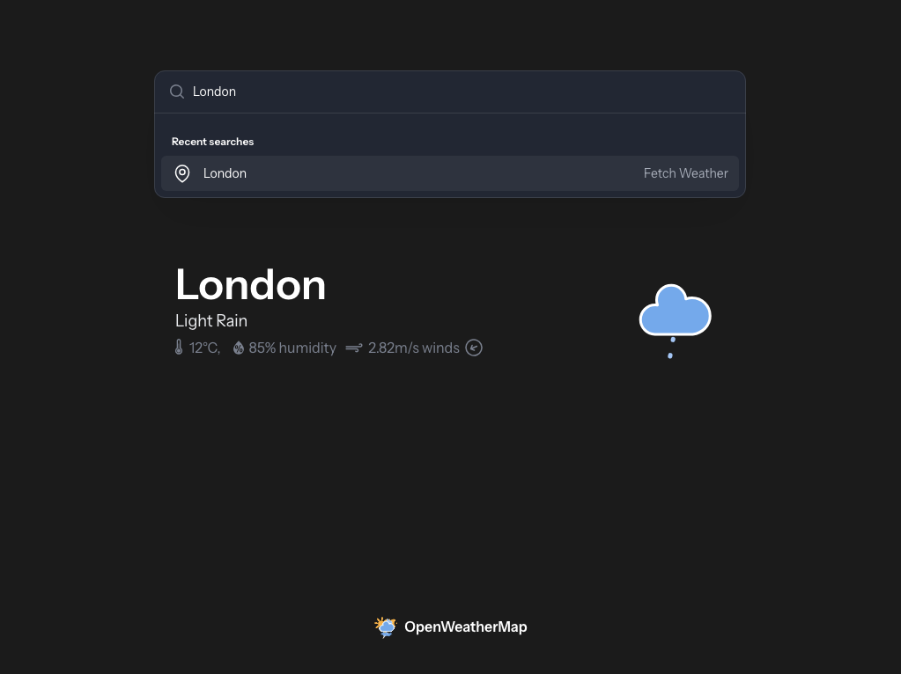

# OpenWeatherMap Client

A simple Laravel application test to interface with the OpenWeather Map API.



## Requirments

The application requires the following dependencies and their respective versions:

* PHP 8.3+
* Node 22+

**Note:** No database is required to run this application.

## Setup

1. Clone this repository

```sh
git clone https://github.com/garygarside/openweathermap-client
```

2. Run the application setup:

```sh
composer run-script setup
```

3. Create your local `.env` file and populate the `OPENWEATHER_API_KEY` variable:

4. Build and serve the application:

```sh
composer run-script dev
```

You should now be able to access the application on [http://localhost:8000](http://localhost:8000).

Use the search box at the top of the page to search for a UK location. Certain UK based cities are available via autosuggest. Your 3 most recent searches will be stored for quick reference.

## Linting

This application uses PSR-12 coding standards via Laravel Pint for linting:

To lint the application:

```sh
composer run-script lint
```

To lint and fix:

```sh
composer run-script fix
```

## Static Analysis

The application includes the PHP Stan package for static anaylsis, primarily on the `/app` folder. To analyse:

```sh
composer run-script stan
```

## Testing

The application includes Pest for unit, feature, and endpoint testing. Run tests using:

```sh
php artisan test
```